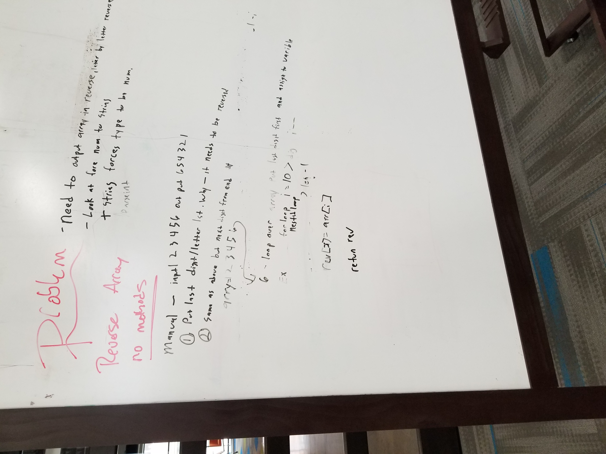
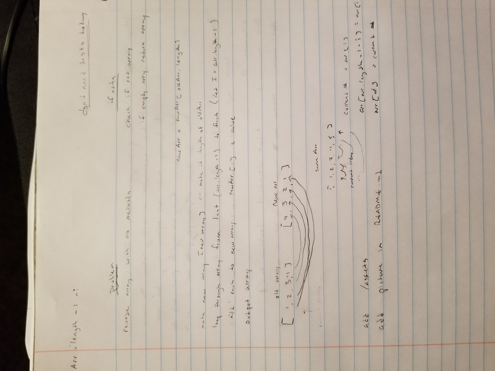

# Reverse an Array
an array must be reversed without using methods

## Challenge
given an array i must reverse whats in the array 

## Approach & Efficiency
first reverse i wanted to swap the first with the last until i reached the middle, while keeping the same array. 

second pushes the numbers from the end of the first array to the new array

## Solution
didn't use this whiteboard but i couldn't do much with the partner taking up time and not listesning to anything i said

have a short rework of my own though you probably wont be able to read much as i write tiny

